<div align="center">
  
</div>

<div align="center">

[](#)
[](#)
[](#)
[](#)
[](#)

<sub>⚠️ links above are placeholders — swap the `#` for your real URLs</sub>

</div>

<br>

```bash
keshav@dev-machine:~$ whoami
```

🎓 Pre-Final Year B.E. Student — Artificial Intelligence & Machine Learning
💻 Full-Stack Developer building scalable web apps and AI-powered solutions
🚀 Into Backend Development, Machine Learning, System Design & Blockchain
🌱 Currently sharpening Data Structures & Algorithms and modern software architectures
🎯 Goal: land a Software Development Engineer role at a top product-based company

---

```bash
keshav@dev-machine:~$ cat /proc/tech_stack
```

<pre>
┌────────────────────────────────────────────────────────────────────────────────────────────┐
│  LANGUAGES                   WEB & BACKEND                     AI/ML & DATA                │
│  ─────────                   ─────────────                     ─────────────               │
│  C++                         React.js / Next.js                Scikit-Learn                │
│  Java                        HTML5 / CSS3 / Bootstrap           Pandas                      │
│  Python                      Node.js / Express.js               NumPy                       │
│  C                           Flask / Django                     Matplotlib                  │
│  JavaScript                  REST APIs                          MongoDB / MySQL             │
└────────────────────────────────────────────────────────────────────────────────────────────┘
</pre>

<p align="center">
  
</p>

---

```bash
keshav@dev-machine:~$ ls -la ~/projects --sort=impact
```

<table width="100%">
<tr>

<td width="50%" valign="top">

<pre>
drwxr-xr-x  ElectionChain/
├── contracts/     # Solidity Smart Contracts
├── gis/           # Overpass API Mapping
├── identity/      # Multi-Tier Voter Auth
├── audit/         # Tamper-Proof Ledger
└── api/           # Node + Express APIs
</pre>

> ⛓️ **Blockchain-Based Online Election Platform**

A secure, transparent election ecosystem combining blockchain smart contracts, dynamic GIS constituency mapping, and decentralized audit trails for tamper-proof voting — architected to scale across all 543 Parliamentary Constituencies.

**Highlights**
* Multi-tier identity roles: Central Admin, Returning Officer, Electoral Registry, Presiding Officer
* Solidity smart contracts for immutable vote recording
* Live OpenStreetMap Overpass API integration for constituency mapping
* Rule 49P Tendered Ballot simulation

`React.js` `Node.js` `Express.js` `MongoDB` `Solidity` `Ethers.js` `Hardhat`

</td>

<td width="50%" valign="top">

<pre>
drwxr-xr-x  SafeDerm/
├── model/         # CNN Skin Classifier
├── preprocessing/ # Image Cleaning Pipeline
├── inference/     # Prediction Service
└── app/           # User-Facing Interface
</pre>

> 🩺 **SafeDerm — AI Skin Diagnostics**

An AI-powered app that analyzes skin images to flag potential dermatological conditions early, aiming to make a first-pass diagnostic signal more accessible.

**Tech Stack**
`Python` `TensorFlow / Keras` `CNN` `OpenCV` `Flask`

<p>

</p>

<sub>⚠️ stack above is a placeholder — confirm/replace once finalized</sub>

</td>

</tr>

<tr>

<td width="50%" valign="top">

<pre>
drwxr-xr-x  CampusSphere/
├── auth/          # JWT Authentication
├── dashboard/     # Student • Faculty • Admin
├── attendance/    # Attendance Management
├── courses/       # Course Management
└── api/           # REST APIs
</pre>

> 🎓 **CampusSphere**

A modern College ERP platform built on the MERN stack, featuring JWT authentication, role-based access control, attendance management, academic modules, and scalable REST APIs.

`MongoDB` `Express.js` `React.js` `Node.js` `JWT`

<p>

</p>

</td>

<td width="50%" valign="top">

<pre>
drwxr-xr-x  HostelManager/
├── booking/       # Online Room Booking
├── allocation/    # Room Allocation Engine
├── payments/      # Payment Integration
├── admin/         # Admin Dashboard
└── realtime/      # WebSocket Updates
</pre>

> 🏨 **Smart Hostel Management System**

A complete hostel booking and management platform with room allocation, student management, online booking, payment integration, and a real-time admin dashboard.

`Django` `MySQL` `WebSockets`

</td>

</tr>
</table>

<div align="center">
<sub>+ more on the way — this list keeps growing</sub>
</div>

---

```bash
keshav@dev-machine:~$ cat philosophy.md
```

> "Code is not just about solving problems. It's about creating solutions that scale, inspire, and make an impact."

<br>

<div align="center">

*Turning cant's into cans and dreams into plans.* ⚡

</div>
